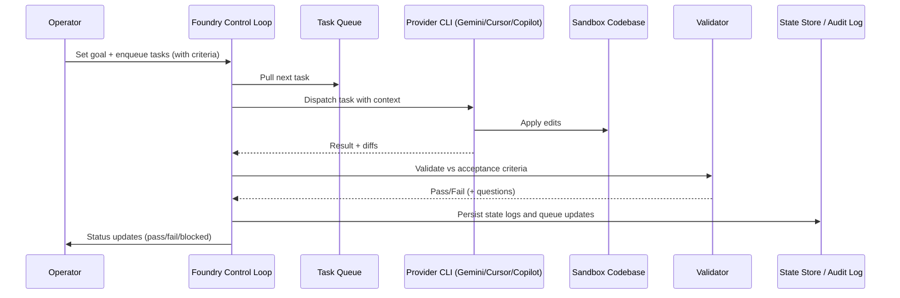

# Foundry


### **The Persistent Control Plane for Autonomous AI Software Factories.**

<br>

> [!WARNING]
> **Public Beta Notice**
> 
> Foundry is currently in **Active Beta**. While the core control loop and state persistence are stable, internal APIs and task schemas may evolve. 
> 
> **Bring Your Own Keys (BYOK)**: Foundry requires your own agentic subscriptions (API keys for Gemini, Copilot, Cursor, etc.). You are responsible for managing your subscription credentials and associated costs.
> 
> **Use with caution** in production environments. We recommend monitoring execution via the `audit.log` or verbose logs.


## What This Is

Foundry is an **autonomous AI software development platform** and orchestration engine designed to build **real software at scale**.

It acts as a **persistent AI developer**—coordinating agents, validating every step, and resuming long-running builds reliably without losing context or requiring manual recovery.

Foundry works through your **goal** and **tasks**, using AI agents Providers (Gemini, Cursor, Copilot), validating relentlessly, and persisting state after every step. If it crashes? Resume where it left off. No manual babysitting.


**Built for multi-day agentic coding workflows. Built for determinism. Built for autonomous workflows for lower costs.**

## Why Foundry Exists

**The Challenge with Long Agentic Coding Chains:**
- **Context degradation**: After multiple task repetitions and iterations, agent drift occurs → Links between contexts break → Tasks can't reference prior work reliably
- **Manual recovery burden**: If execution halts, resuming requires human intervention and feedback → Wasted setup time
- **Cost spiral**: Without validation, agents make redundant calls → Token costs accumulate
- **No audit trail**: Can't review what happened or why it failed

**The Solution**: Foundry acts as a **deterministic supervisor** for agentic chains. It orchestrates tasks, validates outputs relentlessly, maintains context across repetitions, and keeps costs bounded.

## How It Works: The Three Pillars

### 1. You Control the Scope (Operator Authority)
- Define a **goal** (what the project achieves)
- Enqueue **tasks** with acceptance criteria (what each task delivers)
- Provide **boilerplate code** or existing codebase (starting point)

Foundry never invents scope, expands goals, or makes autonomous decisions. You're in control. It's just execution.

### 2. Foundry Executes Reliably (Deterministic Validation)
- Tasks run sequentially in an isolated sandbox
- Each output is validated against acceptance criteria
- State persists after every step (DragonflyDB)
- On failure: Auto-retry with feedback, or block and wait for your input

**Reduces hallucinations via validation. Maintains context across iterations. Predictable behavior via deterministic checks.**

### 3. Cost-Optimized by Design (Hybrid Control Plane)
Agentic APIs are expensive. Foundry uses a **local-first strategy**:
- **Routine validation runs locally** (regex checks, file validation, code structure analysis without API calls) = **no API token cost**
- **Helper agent sessions are cached** per project feature = **token reduction across iterations**
- **AI agents only handle true reasoning** = **every API call earns its cost**

Result: Multi-day agentic chains with bounded token consumption compared to naive approaches.

## Overview

Foundry is a **control mechanism** that:
- Holds externally injected goals
- Maintains persistent state
- Executes a fixed control loop
- Delegates tasks to provider/agent CLIs
- Validates results
- Retries on validation failures and ambiguity (up to max retries)
- Halts only on critical failures (execution errors, blocked status)

It does **not**:
- Invent goals
- Act independently
- Replace the operator
- Make autonomous decisions

## Installation

### Prerequisites

- **Node.js**: LTS version (install via [nvm](https://github.com/nvm-sh/nvm))
- **Docker & Docker Compose**: For running DragonflyDB
- **Provider CLI(s)**: Install at least one supported provider CLI (e.g., Gemini, Copilot, Cursor). Cursor-specific docs: [Cursor CLI](https://cursor.com/cli)

### Install Dependencies

```bash
npm install
```

### Build

```bash
npm run build
```

## Infrastructure Setup

### Start DragonflyDB

Foundry uses DragonflyDB (Redis-compatible) for state persistence and task queuing.

1. **Start DragonflyDB container**:
   ```bash
   docker-compose up -d
   ```

2. **Verify DragonflyDB is running**:
   ```bash
   docker ps | grep dragonflydb
   # Should show container running on port 6499
   ```

3. **Test connection** (optional):
   ```bash
   redis-cli -h localhost -p 6499 ping
   # Should return: PONG
   ```

### Stop DragonflyDB

```bash
docker-compose down
```

To remove data volume:
```bash
docker-compose down -v
```

## Configuration

Foundry uses environment variables for configuration. Copy `.env.example` to `.env` and adjust as needed.

```bash
cp .env.example .env
```

### Key Environment Variables

| Variable | Description | Default | 
| :--- | :--- | :--- |
| **Provider Keys** | | |
| `ANTHROPIC_API_KEY` | API Key for Claude (via Anthropic) | |
| `OPENROUTER_API_KEY` | API Key for OpenRouter (optional) | |
| **CLI Paths** | Override if tools are not in PATH | |
| `GEMINI_CLI_PATH` | Path to Gemini CLI | `gemini` or `npx` |
| `COPILOT_CLI_PATH` | Path to Copilot CLI | `npx` |
| `CURSOR_CLI_PATH` | Path to Cursor CLI | `cursor` |
| **State Management** | | |
| `REDIS_HOST` | DragonflyDB/Redis Host | `localhost` |
| `REDIS_PORT` | DragonflyDB/Redis Port | `6499` |
| `STATE_KEY` | Redis key for supervisor state | `supervisor:state` |
| **Validation** | | |
| `HELPER_DETERMINISTIC_ENABLED` | Enable local file/regex validation | `true` |
| `HELPER_AGENT_MODE` | Helper Agent Mode (`auto`/`manual`) | `auto` |
| `USE_LOCAL_HELPER_AGENT` | Use local Ollama for validation | `true` |
| **System** | | |
| `CIRCUIT_BREAKER_TTL_SECONDS` | Time before retrying failed provider | `86400` |
| `PERFORMANCE_LOGGING_ENABLED` | Enable detailed perf logs | `false` |

## Usage

### Software Factory Workflow

The typical workflow follows this pattern:

1. **Prepare Code Boilerplates** (optional but recommended)
2. **Initialize Foundry State**
3. **Set Goal**
4. **Enqueue Tasks**
5. **Start Foundry** (autonomous execution)

### 0. Prepare Code Boilerplates (Optional)

Before starting Foundry, you can prepare initial code in the sandbox directory:

```bash
# Create project directory
mkdir -p sandbox/my-project

# Copy boilerplate/starter code
cp -r my-boilerplate/* sandbox/my-project/

# Or initialize a new project structure
## (You can also use the Foundry for this, BUT might as well save tokens and resources where you can - AI has a huge carbon footprint)
cd sandbox/my-project
npm init -y
# ... add initial files, dependencies, etc.
```

**What to include in boilerplates**:
- Project structure (directories, config files)
- Initial dependencies (`package.json`, `requirements.txt`, etc.)
- Starter templates (React components, API routes, etc.)
- Configuration files (`.env.example`, `tsconfig.json`, etc.)
- Existing codebase (if continuing work on an existing project)

Foundry will **work with and build upon** this existing code. Tasks can reference existing files, extend functionality, or create new features.

**Example**: If you have a React boilerplate with `src/App.tsx`, tasks can extend it:
```json
{
  "task_id": "add-auth",
  "instructions": "Extend the existing App.tsx component to add user authentication. The component is located at src/App.tsx and uses React Router. Follow the existing code style and patterns.",
  ...
}
```

### 1. Initialize Foundry State

Before using Foundry, initialize the state key:

```bash
npm run cli -- init-state
```

This creates a state with a default placeholder goal. You can immediately proceed to `start`, or set a real goal first with `set-goal`.

**Optional parameters**:
- `--redis-host`: DragonflyDB host (default: `localhost`)
- `--redis-port`: DragonflyDB port (default: `6499`)
- `--state-key`: Fixed key name for state (default: `supervisor:state`)
- `--queue-name`: Task queue name (default: `tasks`)
- `--queue-db`: Database index for queue (default: `2`)
- `--state-db`: Database index for state (default: `0`)
- `--execution-mode`: `AUTO` or `MANUAL` (default: `AUTO`)
- `--goal`: Goal description (optional; defaults to placeholder "[Placeholder] Goal to be set"; can be updated via `set-goal`)

**Example with custom goal during init**:
```bash
npm run cli -- init-state --execution-mode AUTO --goal "Build a simple REST API"
```

### Do note, you can review the [README in ./UI directory](/UI/README.md) to start up supervisor dashboard as well to visually understand of what you are doing. 


### 2. Set or Update Goal

Define or update the goal Foundry will work towards:

```bash
npm run cli -- set-goal \
  --description "A simplified, senior-friendly classifieds super app built with React and Tailwind CSS that aggregates property and vehicle listings into a single, accessible mobile-first experience. The platform combines a robust backend aggregation and scraping system that continuously collects, normalizes, and enriches listings from multiple external sources with a subscription-based daily curated feed that prioritizes relevance, freshness, and user preferences. Featuring phone-only authentication, clear navigation, large readable UI elements, and intelligent search, the system is designed to reduce noise and complexity for end users while delivering a reliable, scalable, and continuously updated marketplace, with the frontend located in ./sandbox/easeclassifieds and the backend and aggregation services in ./sandbox/easeclassifieds-api." \
  --project-id easeclassifieds
```

**Parameters**:
- `--description`: Goal description (required)
- `--project-id`: Project identifier (optional, used for sandbox directory)

**Important**: The `--project-id` should match the directory name in `sandbox/` where your boilerplates are located (e.g., if you created `sandbox/my-project/`, use `--project-id my-project`).

### 3. Create Task File(s)

Create task JSON file(s) following the task schema. You can create either:
- **Single task file**: Contains one task object
- **Array of tasks file**: Contains an array of task objects (all enqueued at once)

**Example: Single task file `task-1.json`**
```json
{
  "task_id": "task-001",
  "intent": "Create API endpoint structure",
  "tool": "gemini",
  "instructions": "Create a REST API with Express.js. Include routes for /api/v1/users and /api/v1/auth. Use TypeScript.",
  "acceptance_criteria": [
    "Express server starts on port 3000",
    "Routes /api/v1/users and /api/v1/auth exist",
    "TypeScript configuration is present",
    "package.json includes express and @types/express"
  ],
  "retry_policy": {
    "max_retries": 2
  },
  "status": "pending",
  "working_directory": "my-backend-api",
  "required_artifacts": [
    "src/server.ts",
    "src/routes/users.ts",
    "src/routes/auth.ts",
    "tsconfig.json",
    "package.json"
  ],
  "test_command": "npm run test",
  "tests_required": false
}
```

**Example: Array of tasks file `tasks.json`**

Tasks can reference existing files from your boilerplates. For example:
```json
[
  {
    "task_id": "frontend-001",
    "intent": "Extend existing React component",
    "tool": "gemini",
    "instructions": "Extend the existing App.tsx component (located at src/App.tsx) to add user authentication. Follow the existing code style and patterns.",
    "acceptance_criteria": [
      "App.tsx includes authentication logic",
      "Uses existing React Router setup",
      "Follows existing code style"
    ],
    "retry_policy": {
      "max_retries": 2
    },
    "status": "pending"
  },
  {
    "task_id": "backend-001",
    "intent": "Create API endpoint structure",
    "tool": "copilot",
    "instructions": "Create a REST API with Express.js. Include routes for /api/v1/users and /api/v1/auth. Use TypeScript.",
    "acceptance_criteria": [
      "Express server starts on port 3000",
      "Routes /api/v1/users and /api/v1/auth exist",
      "TypeScript configuration is present",
      "package.json includes express and @types/express"
    ],
    "retry_policy": {
      "max_retries": 2
    },
    "status": "pending",
    "working_directory": "my-backend-api",
    "required_artifacts": [
      "src/server.ts",
      "src/routes/users.ts",
      "src/routes/auth.ts",
      "tsconfig.json",
      "package.json"
    ],
    "tests_required": false
  },
  {
    "task_id": "backend-002",
    "intent": "Add authentication middleware",
    "tool": "claude",
    "instructions": "Implement JWT authentication middleware for Express routes.",
    "acceptance_criteria": [
      "JWT middleware validates tokens",
      "Protected routes require authentication",
      "Middleware handles expired tokens"
    ],
    "retry_policy": {
      "max_retries": 2
    },
    "status": "pending",
    "working_directory": "my-backend-api",
    "required_artifacts": [
      "src/middleware/auth.ts"
    ],
    "tests_required": false
  }
]
```

**Task Schema Fields**:
- `task_id`: Unique identifier
- `intent`: Brief description of task purpose
- `tool`: Provider/agent to execute the task (`cursor`, `gemini`, `gemini_stub`, `copilot`, `codex`, `claude`)
- `instructions`: Detailed instructions for the selected provider CLI
- `acceptance_criteria`: Array of strings, ALL must be met
- `retry_policy`: Retry configuration (typically `max_retries: 3`)
- `status`: Initial status (typically `"pending"`)
- `working_directory`: Optional relative path from sandboxRoot (overrides project_id-based default)
- `required_artifacts`: Array of file paths (relative to sandbox project directory, optional)
- `test_command`: Command to run for validation (optional)
- `tests_required`: Whether tests must pass (boolean, optional)

**Recommended file organization**:
```
supervisor/
├── tasks/              # Task files directory
│   ├── task-001.json   # Single task
│   ├── task-002.json   # Single task
│   └── tasks.json      # Array of tasks
├── src/
└── sandbox/
```

### 4. Enqueue Tasks

Add tasks to the queue. The `enqueue` command supports both single task objects and arrays:

**Enqueue a single task file**:
```bash
npm run cli -- enqueue \
  --redis-host localhost \
  --redis-port 6499 \
  --state-key supervisor:state \
  --queue-name tasks \
  --queue-db 2 \
  --task-file tasks/task-001.json
```

**Enqueue an array of tasks from one file**:
```bash
npm run cli -- enqueue \
  --redis-host localhost \
  --redis-port 6499 \
  --state-key supervisor:state \
  --queue-name tasks \
  --queue-db 2 \
  --task-file tasks/tasks.json
```

All tasks will be enqueued in the order they appear (FIFO execution). Tasks are processed in strict First-In-First-Out order: the first task enqueued is the first task processed. The queue uses Redis List with LPUSH (left push) for enqueue and RPOP (right pop) for dequeue to maintain FIFO ordering.

### 5. Start Foundry Control Loop

Run the Foundry control loop (this will process tasks until queue is exhausted or halted):

```bash
npm run cli -- start \
  --redis-host localhost \
  --redis-port 6499 \
  --state-key supervisor:state \
  --queue-name tasks \
  --queue-db 2
```

Foundry will:
1. Load state
2. Check if status is RUNNING (if not, set it with `resume` command first)
3. Dequeue next task
4. Dispatch to the configured provider CLI
5. Validate output
6. Persist state
7. Repeat until queue exhausted or halted

**Note**: The `resume` command only sets the status to RUNNING. Use `start` to actually run the control loop.

### 6. Monitor Execution

**Check Foundry status** (recommended):
```bash
npm run cli -- status \
  --redis-host localhost \
  --redis-port 6499 \
  --state-key supervisor:state \
  --queue-name tasks \
  --queue-db 2
```

This displays:
- Foundry status and iteration
- Goal information and completion status
- Queue status
- Task statistics (completed, blocked)
- Last validation report
- Execution mode and metadata

**Check audit logs**:
```bash
cat sandbox/<project-id>/audit.log.jsonl | tail -20
```

**View verbose application logs** (PM2):
```bash
# View all logs (stdout + stderr)
pm2 logs supervisor --lines 100

# View only stdout
pm2 logs supervisor --out --lines 100

# Follow logs in real-time
pm2 logs supervisor --follow

# View logs from log files directly
tail -f logs/supervisor-out.log
tail -f logs/supervisor-error.log
```

Verbose logs include:
- `[VERBOSE]` - Detailed application logic and state information
- `[PERFORMANCE]` - Operation timing and performance metrics
- `[STATE_TRANSITION]` - State changes and transitions
- Standard iteration and task processing logs

**Alternative: Check status via redis-cli**:
```bash
redis-cli -h localhost -p 6499 GET supervisor:state | jq '.supervisor.status'
```

**View current task**:
```bash
redis-cli -h localhost -p 6499 GET supervisor:state | jq '.current_task'
```

### 7. Halt Foundry

To stop execution (e.g., on ambiguity or operator intervention):

```bash
npm run cli -- halt \
  --redis-host localhost \
  --redis-port 6499 \
  --state-key supervisor:state \
  --queue-name tasks \
  --queue-db 2 \
  --reason "Operator intervention"
```

### 8. Resume After Halt

After resolving issues, first set status to RUNNING, then start the control loop:

```bash
# Set status to RUNNING
npm run cli -- resume \
  --redis-host localhost \
  --redis-port 6499 \
  --state-key supervisor:state \
  --queue-name tasks \
  --queue-db 2

# Start the control loop
npm run cli -- start \
  --redis-host localhost \
  --redis-port 6499 \
  --state-key supervisor:state \
  --queue-name tasks \
  --queue-db 2
```

## Complete Workflow Example

```bash
# 1. Start infrastructure
docker-compose up -d

# 2. Initialize Foundry (all defaults)
npm run cli -- init-state

# 3. Set goal
npm run cli -- set-goal \
  --description "Build microservice with 3 endpoints" \
  --project-id my-service

# 4. Create and enqueue tasks
# Option A: Enqueue single task files
npm run cli -- enqueue \
  --redis-host localhost \
  --redis-port 6499 \
  --state-key supervisor:state \
  --queue-name tasks \
  --queue-db 2 \
  --task-file tasks/task-1.json

npm run cli -- enqueue \
  --redis-host localhost \
  --redis-port 6499 \
  --state-key supervisor:state \
  --queue-name tasks \
  --queue-db 2 \
  --task-file tasks/task-2.json

# Option B: Enqueue array of tasks from one file
npm run cli -- enqueue \
  --redis-host localhost \
  --redis-port 6499 \
  --state-key supervisor:state \
  --queue-name tasks \
  --queue-db 2 \
  --task-file tasks/all-tasks.json

# 5. Start Foundry control loop
npm run cli -- start \
  --redis-host localhost \
  --redis-port 6499 \
  --state-key supervisor:state \
  --queue-name tasks \
  --queue-db 2

# 6. Monitor (in another terminal)
# View audit logs
tail -f sandbox/my-service/audit.log.jsonl

# Or view verbose application logs
pm2 logs supervisor --follow
```

## How It Works - Detailed

Foundry operates as an agentic **control plane** that executes operator-defined tasks through a fixed control loop.  

It maintains persistent state in DragonflyDB (Redis-compatible), manages a FIFO task queue, dispatches tasks to your chosen Agents/Providers (Gemini, Copilot, Cursor) with injected state context, and validates outputs deterministically.  
(We have [parallelism](/docs/plans/task-dependencies-parallel-execution.md) being worked upon as our roadmap - open to contribution.)

The system enforces sandbox isolation per project, provides append-only audit logging, and supports recovery from crashes or restarts by reloading persisted state.

Foundry never invents goals, expands scope, or makes autonomous decisions—all authority remains with the operator who injects goals and tasks explicitly.

### Execution Stages (Current)
- **Local pre-processing** (Before Agent Call): System tools and scripts execute deterministic checks—regex safety validation, file/byte capacity enforcement, semver compatibility checks, code structure analysis. These run locally without API token cost and may resolve validation gaps, but non-deterministic tasks still require agent review. Flags: `HELPER_DETERMINISTIC_ENABLED`, `HELPER_DETERMINISTIC_PERCENT`.
- **Provider dispatch**: Task sent to Agents/Providers (Gemini, Copilot, Cursor) with state/context injection and session reuse when available. Provider executes task and returns result.
- **Helper agent fallback**: When deterministic checks or provider output leave validation gaps, helper agent generates verification commands to confirm correctness. Helper sessions are reused per project feature to retain context and reduce token consumption.
- **Analytics & metrics**: JSONL metrics (helper durations avg/p95, cache-hit rate, deterministic attempts/success, token usage) persisted alongside audit logs for cost visibility.

### Session Reuse
- Session IDs resolved per feature (`task:prefix` or `project:<id>`) with caps and error thresholds.
- Helper sessions isolated under `helper:validation:<projectId>` and persisted in `state.active_sessions`.
- Toggle via `DISABLE_SESSION_REUSE` if rollback is required.

### High-Level Data Flow


<br>

**Component stack (quick map)**
- Control Loop: deterministic executor orchestrating tasks.
- Task Queue: FIFO of operator-defined tasks.
- Provider CLIs: worker tools for code changes (Gemini/Cursor/Copilot).
- Sandbox: project workspace for applied edits.
- Validator: checks against acceptance criteria; blocks on ambiguity.
- State Store & Audit Log: persistent state, append-only logs, recovery.


## Architecture

- **Operator Interface** (`src/infrastructure/tooling/project-cli/cli.ts`): CLI commands for operator control
- **Foundry Core** (`src/application/entrypoint/controlLoop.ts`): Main control loop
- **Tool Dispatcher** (`src/infrastructure/connectors/agents/providers/*`, `src/domain/agents/promptBuilder.ts`): CLI integration
- **Persistence Layer** (`src/application/services/persistence.ts`): DragonflyDB state management
- **Queue Adapter** (`src/domain/executors/taskQueue.ts`): Redis List-based task queue
- **Validator** (`src/application/services/validator.ts`): Deterministic validation
- **AST Service** (`src/application/services/ASTService.ts`): Structural code analysis
- **Validation Cache** (`src/application/services/validationCache.ts`): Redis-based result caching
- **Analytics Service** (`src/application/services/analytics.ts`): Performance tracking
- **Audit Logger** (`src/infrastructure/adapters/logging/auditLogger.ts`): Append-only logging
- **Logger** (`src/infrastructure/adapters/logging/logger.ts`): Centralized verbose logging with stdout flushing for PM2

## Documentation

All specifications and documentation are in the `docs/` directory:

- [Control Loop](docs/LOOP.md) - Control loop steps
- [State Management](docs/STATE_LIFECYCLE.md) - State lifecycle rules
- [Tool Contracts](docs/TOOL_CONTRACTS.md) - Provider/agent contract
- [Validation](docs/VALIDATION.md) - Validation rules
- [Sandbox](docs/SANDBOX.md) - Sandbox enforcement
- [Recovery](docs/RECOVERY.md) - Recovery scenarios
- [Runbook](docs/RUNBOOK.md) - Operational procedures

See [docs/IMPLEMENTATION_REVIEW.md](docs/IMPLEMENTATION_REVIEW.md) for implementation status.

## State Schema

- [State Schema](STATE_SCHEMA.json) - Foundry state structure
- [Task Schema](TASK_SCHEMA.json) - Task structure

## Configuration

### Environment Variables

Set these before running commands:

```bash
export CURSOR_CLI_PATH=/path/to/cursor  # Optional, only if using Cursor CLI (defaults to 'cursor agent')
```

### CLI Global Options

All commands require these global options:

- `--redis-host <host>` - DragonflyDB host (required, default: `localhost`)
- `--redis-port <port>` - DragonflyDB port (required, default: `6499`)
- `--state-key <key>` - State key (required, operator-defined, e.g., `supervisor:state`)
- `--queue-name <name>` - Task queue name (required, e.g., `tasks`)
- `--queue-db <index>` - Queue database index (required, must differ from state DB, e.g., `2`)
- `--state-db <index>` - State database index (optional, default: `0`)
- `--sandbox-root <path>` - Sandbox root directory (optional, default: `./sandbox`)

### Command-Specific Options

**`init-state`**:
- `--execution-mode <mode>` - `AUTO` or `MANUAL` (default: `AUTO`)
- `--goal <description>` - Goal description (optional; defaults to placeholder if not set)

**`set-goal`**:
- `--description <text>` - Goal description (required)
- `--project-id <id>` - Project identifier (optional)

**`enqueue`**:
- `--task-file <path>` - Path to task JSON file (required)

**`halt`**:
- `--reason <text>` - Halt reason (optional)

## Common Operations

### Check Foundry Status

**Using the status command** (recommended):
```bash
npm run cli -- status \
  --redis-host localhost \
  --redis-port 6499 \
  --state-key supervisor:state \
  --queue-name tasks \
  --queue-db 2
```

**Check performance metrics**:
```bash
npm run cli -- metrics \
  --redis-host localhost \
  --redis-port 6499 \
  --state-key supervisor:state \
  --queue-name tasks \
  --queue-db 2
```

**Alternative: Using redis-cli**:
```bash
redis-cli -h localhost -p 6499 GET supervisor:state | jq '.supervisor'
```

### View Current Goal

```bash
redis-cli -h localhost -p 6499 GET supervisor:state | jq '.goal'
```

### List Completed Tasks

```bash
redis-cli -h localhost -p 6499 GET supervisor:state | jq '.completed_tasks'
```

### View Audit Logs

```bash
# All logs
cat sandbox/<project-id>/audit.log.jsonl

# Last 50 lines
tail -50 sandbox/<project-id>/audit.log.jsonl

# Follow logs
tail -f sandbox/<project-id>/audit.log.jsonl

# Filter by task
cat sandbox/<project-id>/audit.log.jsonl | jq 'select(.task_id == "task-001")'
```

### View Verbose Application Logs

Foundry provides detailed verbose logging for debugging and monitoring:

```bash
# View PM2 logs (recommended)
pm2 logs supervisor --lines 100

# Follow logs in real-time
pm2 logs supervisor --follow

# View from log files
tail -f logs/supervisor-out.log
tail -f logs/supervisor-error.log

# Filter for specific log types
pm2 logs supervisor --lines 200 | grep "\[VERBOSE\]"
pm2 logs supervisor --lines 200 | grep "\[PERFORMANCE\]"
pm2 logs supervisor --lines 200 | grep "\[STATE_TRANSITION\]"
```

**Log Types**:
- **`[VERBOSE]`** - Detailed application logic, state information, and decision points
- **`[PERFORMANCE]`** - Operation timing metrics (duration in milliseconds)
- **`[STATE_TRANSITION]`** - State changes and transitions (e.g., `RUNNING → HALTED`)
- **Standard logs** - Iteration numbers, task IDs, validation results, etc.

**Example verbose log output**:
```
[2025-12-28T15:48:06.123Z] [VERBOSE] [ControlLoop] Starting iteration 1
[2025-12-28T15:48:06.125Z] [PERFORMANCE] StateLoad took 15ms | Metadata: {"iteration":1}
[2025-12-28T15:48:06.130Z] [VERBOSE] [ControlLoop] State loaded successfully | Data: {"iteration":1,"status":"RUNNING"}
[2025-12-28T15:48:06.135Z] [STATE_TRANSITION] CHECKING → RUNNING | Context: {"iteration":1}
[2025-12-28T15:48:06.140Z] [PERFORMANCE] TaskRetrieval took 5ms | Metadata: {"iteration":1,"source":"queue","has_task":true}
```

### Clear State

**Warning**: This deletes all state. Use with caution.

```bash
redis-cli -h localhost -p 6499 DEL supervisor:state
```

### State Management

To dump the current state to a JSON file (for debugging or backup):

```bash
npm run tsx scripts/dump-state.ts -- \
  --redis-host localhost \
  --redis-port 6499 \
  --state-key supervisor:state \
  --output STATE.json
```

To load state from a JSON file (overwriting Redis state):

```bash
npm run tsx scripts/load-state.ts -- \
  --redis-host localhost \
  --redis-port 6499 \
  --state-key supervisor:state \
  --input STATE.json
```

### Reset Queue

```bash
# Connect to queue database
redis-cli -h localhost -p 6499 -n 2

# List queue keys
KEYS *

# Clear queue (if needed)
FLUSHDB
```

## Troubleshooting

### Diagnostics & Investigation Tools

For troubleshooting system issues, use the [Investigation Scripts](./scripts/investigations/README.md) toolkit—a set of reusable diagnostic tools for inspecting provider health, task queue state, and execution logs.

**Quick Diagnostics**:
```bash
# Check provider status and circuit breakers
npx ts-node scripts/investigations/provider-health.ts

# Inspect task queue and blocked tasks
npx ts-node scripts/investigations/task-queue-inspect.ts

# Analyze execution logs and error patterns
npx ts-node scripts/investigations/log-analyzer.ts --summary
```

For detailed usage, examples, and a troubleshooting matrix, see [Investigation Scripts README](./scripts/investigations/README.md).

### DragonflyDB Not Starting

```bash
# Check logs
docker-compose logs dragonflydb

# Check if port is in use
lsof -i :6499

# Restart container
docker-compose restart dragonflydb
```

### Cursor CLI Not Found

```bash
# Check if cursor is in PATH
which cursor

# Set explicit path
export CURSOR_CLI_PATH=/path/to/cursor

# Verify it works
cursor --version
```

### State Key Already Exists

If you see "State key already exists" error:

```bash
# Option 1: Use different key
npm run cli -- init-state --state-key supervisor:state:new ...

# Option 2: Delete existing state (WARNING: loses all data)
redis-cli -h localhost -p 6499 DEL supervisor:state
```

### Foundry Retry Behavior

Foundry now automatically retries tasks on validation failures or ambiguity:

1. **Validation Failures**: If a task fails validation, Foundry:
   - Generates a fix prompt with validation feedback
   - Retries the task (up to `max_retries` from `retry_policy`, default: 3)
   - Only blocks the task if max retries exceeded (Foundry continues to next task)

2. **Ambiguity/Questions**: If ambiguity or questions are detected:
   - Foundry validates the output first (may be a false positive)
   - If validation passes but ambiguity detected, generates clarification prompt
   - Retries with instructions to avoid ambiguous language
   - Only halts on critical failures (execution errors, blocked status)

3. **Task Blocking**: After max retries, tasks are marked as blocked:
   ```bash
   redis-cli -h localhost -p 6499 GET supervisor:state | jq '.blocked_tasks'
   ```

4. **Critical Halts**: Foundry only halts immediately on:
   - `CURSOR_EXEC_FAILURE`: Cursor CLI execution failed
   - `BLOCKED`: Cursor explicitly reported blocked status
   - `OUTPUT_FORMAT_INVALID`: Output format doesn't match expected schema

### Task Validation Failed

1. **Check validation report**:
   ```bash
   redis-cli -h localhost -p 6499 GET supervisor:state | jq '.last_validation_report'
   ```

2. **Review failed rules**:
   ```bash
   redis-cli -h localhost -p 6499 GET supervisor:state | jq '.last_validation_report.rules_failed'
   ```

3. **Check retry count**:
   ```bash
   redis-cli -h localhost -p 6499 GET supervisor:state | jq '.supervisor | to_entries | map(select(.key | startswith("retry_count_")))'
   ```

4. **Foundry will automatically retry** - no manual intervention needed unless max retries exceeded

### Queue Exhausted but Goal Incomplete

If queue is exhausted but goal is not complete:

1. **Check queue status**:
   ```bash
   redis-cli -h localhost -p 6499 GET supervisor:state | jq '.queue'
   ```

2. **Enqueue additional tasks**:
   ```bash
npm run cli -- enqueue --task-file task-next.json ...
```

3. **Resume Foundry**:
   ```bash
npm run cli -- resume ...
```

### Sandbox Directory Issues

If tasks fail due to sandbox path issues:

1. **Check sandbox root**:
   ```bash
   redis-cli -h localhost -p 6499 GET supervisor:state | jq '.goal.project_id'
   ```

2. **Verify directory exists**:
   ```bash
   ls -la sandbox/<project-id>/
   ```

3. **Check permissions**:
   ```bash
   chmod -R 755 sandbox/
   ```

## Sandbox Structure

```
supervisor/
├── sandbox/              # Sandbox root (default: ./sandbox)
│   ├── project-1/        # Project-specific directory
│   │   ├── audit.log.jsonl
│   │   ├── logs/
│   │   │   └── prompts.log.jsonl
│   │   ├── src/          # Your boilerplate/initial code
│   │   ├── package.json   # Dependencies, scripts
│   │   ├── tsconfig.json # Configuration files
│   │   └── ...           # All project files
│   └── project-2/
│       └── ...
```

**Key Points**:
- Place your **code boilerplates** in `sandbox/<project-id>/` before starting
- Foundry will **work with and build upon** existing files
- All project files, logs, and artifacts are contained within the project directory
- Tasks execute in this directory context, so they can reference existing files

## Programmatic Usage

Foundry can be used programmatically by importing from the main entry point:

```typescript
import {
  controlLoop,
  loadState,
  persistState,
  enqueueTask,
  createQueue,
  buildPrompt,
  dispatchToCursor,
  validateTaskOutput,
  checkHardHalts,
  appendAuditLog,
  type SupervisorState,
  type Task,
} from './index';
```

### Example: Custom Control Loop

```typescript
import Redis from 'ioredis';
import { controlLoop, createQueue, loadState } from './index';

const redis = new Redis({ host: 'localhost', port: 6499, db: 0 });
const queue = createQueue('tasks', { host: 'localhost', port: 6499 }, 2);

// Run control loop
await controlLoop(
  persistence,
  queue,
  promptBuilder,
  cursorCLI,
  validator,
  auditLogger,
  './sandbox'
);
```

### Example: Enqueue Task Programmatically

```typescript
import { enqueueTask, createQueue } from './index';
import type { Task } from './index';

const queue = createQueue('tasks', { host: 'localhost', port: 6499 }, 2);

const task: Task = {
  task_id: 'task-001',
  intent: 'Create API endpoint',
  tool: 'cursor',
  instructions: 'Create Express.js endpoint...', 
  acceptance_criteria: ['Server starts', 'Endpoint responds'],
  retry_policy: { max_retries: 3 },
  status: 'pending',
  working_directory: 'my-backend-api', // Optional: overrides project_id default
};

await enqueueTask(queue, task);
await queue.close();
```

See [src/index.ts](src/index.ts) for all exported APIs.

## Key Principles

1. **Deterministic**: No planning, no task invention
2. **Operator Authority**: Operator is sole authority for goals, scope, constraints
3. **Explicit**: All tasks require explicit acceptance criteria
4. **Validation**: No task runs without validation
5. **State Persistence**: State persisted after every step
6. **Retry on Failures**: Validation failures and ambiguity trigger automatic retries (up to max retries)
7. **Optimized**: Skips redundant validation via Redis-based caching
8. **Measurable**: Detailed performance analytics for every task
9. **AUTO MODE**: Default and mandatory execution mode

See [.cursor/rules/supervisor-specs.mdc](.cursor/rules/supervisor-specs.mdc) for complete specifications.

## Local Helper Agent (Optional)

You can configure Foundry to use a local LLM (via Ollama) for helper agent tasks (command generation), reducing latency and cloud costs.

### Prerequisites
- [Ollama](https://ollama.com/) installed and running
- Model pulled (e.g., `ollama pull phi4-mini`)

### Configuration

Add to `.env`:
```bash
USE_LOCAL_HELPER_AGENT=true
LOCAL_HELPER_MODEL=phi4-mini
OLLAMA_BASE_URL=http://localhost:11434
```

### Benefits
- **Latency**: ~3-5s (vs 15-30s cloud)
- **Cost**: Free (no API tokens for validation command generation)
- **Privacy**: Validation logic runs locally

## Environmental Impact: Reducing AI Carbon Footprint

AI inference consumes significant computational resources and energy. Recent research from [Google Cloud (August 2025)](https://cloud.google.com/blog/products/infrastructure/measuring-the-environmental-impact-of-ai-inference/) shows that a single Gemini text prompt uses **0.24 watt-hours of energy** and emits **0.03 grams of CO₂ equivalent**.

Research from [Greenly (May 2025)](https://aimagazine.com/articles/greenly-how-sustainable-can-chatgpt-and-deepseek-really-be) found that ChatGPT-4 processing one million emails monthly generates **7,138 tonnes of CO₂e annually**—comparable to 4,300 round-trip flights between Paris and New York.

### How Foundry Reduces Carbon Footprint

Foundry's hybrid control plane approach reduces unnecessary inference calls and token consumption:

**1. Local Pre-Processing (Reduced Cloud Emissions)**
- Deterministic checks run locally without cloud API calls: regex validation, file caps, semver checks, code structure analysis
- Reduces unnecessary cloud API calls by routing routine validation locally
- Research context: [MIT Technology Review (2023)](https://www.technologyreview.com/2023/12/01/1084189/making-an-image-with-generative-ai-uses-as-much-energy-as-charging-your-phone/) reports that generating text 1,000 times uses as much energy as charging a smartphone to 16%—demonstrating the cumulative cost of repeated inference calls that local pre-processing can avoid

**2. Session Reuse (Token Reduction)**
- Helper agent sessions cached in DragonflyDB prevent context re-injection across iterations
- Reused sessions require fewer input tokens per inference than fresh sessions
- Research context: [Google Cloud's inference optimization achieved 33x energy reduction and 44x carbon footprint reduction in Gemini over 12 months](https://cloud.google.com/blog/products/infrastructure/measuring-the-environmental-impact-of-ai-inference/). Foundry implements similar principles by reducing redundant API calls.

**3. Agent as Last Resort**
- Provider CLIs only engaged when deterministic checks cannot resolve the task
- Aims to route routine validation locally, reserving agent calls for true reasoning tasks
- Comparison: Research shows models using Mixture-of-Experts (MoE) architectures like DeepSeek activate only necessary compute resources, demonstrating the efficiency gains of selective processing

### Why This Matters

While Foundry focuses on inference efficiency (not training), reducing redundant inference calls directly addresses the operational carbon footprint of deployed AI systems.

Academic research ([arXiv:2311.16863](https://arxiv.org/abs/2311.16863), published at ACM FAccT '24) systematically demonstrates that generative, multi-purpose models are orders of magnitude more expensive in terms of energy and emissions than task-specific approaches. Foundry's hybrid strategy aligns with these findings by routing work through local deterministic systems first and only engaging expensive general-purpose models when necessary.

### Best Practices for Cost-Efficient (Carbon-conscious) Deployment

1. **Prepare boilerplates before starting** - Foundry builds from existing code, reducing total task iterations
2. **Use local helper agent when possible** - Configure [Ollama](https://ollama.com/) for verification commands (reduced cloud inference)
3. **Set precise acceptance criteria** - Can reduce validation cycles when criteria are clear
4. **Enable deterministic validation** - Use `HELPER_DETERMINISTIC_ENABLED=true` to prioritize local processing
5. **Monitor token usage** - Track helper durations and cache hit rates to optimize consumption
6. **Reuse sessions across projects** - Feature-scoped session IDs reduce redundant context injection

### Track Your Own Emissions

Use open-source tools to measure and track the carbon footprint of your compute:

- **[CodeCarbon](https://github.com/mlco2/codecarbon)** - Open-source Python package for estimating carbon emissions from compute workloads. Tracks CPU, GPU, RAM power consumption and applies regional carbon intensity data. Supports offline mode, cloud deployments, and integration with Comet ML.
  - Dashboard: https://dashboard.codecarbon.io/
  - Documentation: https://mlco2.github.io/codecarbon/

### References & Further Reading

**Primary Research** (2024-2025):
- **[Google Cloud: "How much energy does Google's AI use? We did the math" (August 2025)](https://cloud.google.com/blog/products/infrastructure/measuring-the-environmental-impact-of-ai-inference/)** - Comprehensive methodology for measuring AI inference emissions. Reports Gemini: 0.24 Wh / 0.03 gCO₂e per prompt. Documents full-stack efficiency approach including TPU optimization, data center overhead (PUE 1.09), and water consumption reduction.

- **[Greenly: "AI Sustainability: Greenly's Findings on DeepSeek & ChatGPT" (May 2025)](https://aimagazine.com/articles/greenly-how-sustainable-can-chatgpt-and-deepseek-really-be)** - Comparative analysis of model efficiency and emissions. Reports ChatGPT-4 at 7,138 tCO₂e annually for processing 1M emails. Discusses Mixture-of-Experts architecture benefits and sustainable AI progression strategies.

**Foundational Research**:
- **[arXiv:2311.16863 - "Power Hungry Processing: Watts Driving the Cost of AI Deployment?" (November 2023, updated October 2024)](https://arxiv.org/abs/2311.16863)** - Systematic comparison of inference costs across ML systems. Published in ACM FAccT '24 (June 3-6, 2024, Rio de Janeiro). Demonstrates generative multi-purpose models are substantially more expensive than task-specific systems for equivalent tasks.

- **[arXiv:1910.09700 - "Quantifying the Carbon Emissions of Machine Learning" (October 2019)](https://arxiv.org/abs/1910.09700)** - Foundational methodology for ML emissions measurement. Introduces Machine Learning Emissions Calculator. Discusses hardware, training duration, and data center location impacts.

**Measurement Tools & Standards**:
- **[CodeCarbon GitHub](https://github.com/mlco2/codecarbon)** - Open-source emissions tracking. Supported by Mila, DataForGoodFR, Comet.ml, and BCG GAMMA. 1.7k+ stars on GitHub with 89+ contributors.

## Important Notes

### Provider Flexibility: Architecture Supports Any Model

Foundry's architecture is **provider-agnostic** by design. The system uses hexagonal, contract-driven architecture: adding new provider connectors (APIs, SDKs, local models, custom agents) requires only implementing the `ProviderConnector` interface in `src/infrastructure/connectors/agents/`. Zero changes to core control loop or state management. We integrate whatever works best for the use case.

**Currently**: Using CLI-based providers (Cursor, Gemini CLI, Copilot, Codex) during development—a pragmatic choice because they're cost-effective (~USD20/month for experimentation). But this is an implementation detail, not an architectural constraint.

### Safeguards: Preventing Interrogation Loops and Token Exhaustion

Foundry enforces hard limits to prevent resource exhaustion:

**Task Retries**:
- `max_retries` per task (configurable in `retry_policy`, default: 3)
- Retries triggered on validation failures or detected ambiguity
- After max retries exhausted: performs **final interrogation round**, then blocks task if still failing
- Blocked tasks are tracked in `state.blocked_tasks` (Foundry continues to next task—never halts on retry exhaustion)

**Interrogation Cycles** (Helper Agent):
- Helper agent invoked **only when deterministic validation fails**
- Batched interrogation: All failed criteria in one prompt per round (not sequential per-criterion)
- Max interrogation rounds: **2 per task** (capped via `maxQuestionsPerCriterion = 2`)
- Pre-analysis before interrogation: Scans codebase for potential file locations matching criterion keywords
- Session reuse prevents context re-injection across iterations (same session = fewer input tokens)
- If interrogation still fails after max rounds → task blocked (no further agent calls)

**Context Window & Token Limits**:
- Per-session context limits enforced by provider:
  - Gemini: 350K tokens (2M context, 500K buffer)
  - Copilot: 350K tokens (conservative)
  - Cursor/Claude: 250K tokens
  - Codex: 8K tokens
  - Default: 100K tokens (fallback)
- When session exceeds limit: automatically starts new session (context preserved, not lost)
- Session error cap: 5 errors before forcing new session
- State context injected per task (minimal snapshot—not cumulative across all tasks)

**Resource Exhaustion**:
- Detected when provider returns resource limit error
- Automatic exponential backoff retry: 1min → 5min → 20min → 1hr → 2hrs
- Max resource exhaustion retries: 0 (executes once per backoff window)
- After exhaustion limit hit: permanently halts (no further processing)

**Monitoring**:
- Analytics service tracks per-task: `interrogation_rounds`, `helper_agent_calls`, `helper_duration_ms`, `cache_hit_rate`, `deterministic_attempts/success`
- Review metrics: `npm run cli -- metrics ...`
- All interrogation prompts and responses logged to `prompts.log.jsonl` for audit

### Design Constraints

1. **Operator Authority**: Only operator injects goals and tasks. Foundry never autonomously expands scope.
2. **Deterministic Execution**: Fixed control loop, no heuristics or learning across runs.
3. **State Persistence**: Every step persists; automatic recovery from crashes by reloading state.
4. **Sandbox Isolation**: Projects isolated per directory; zero cross-project state leakage.
5. **Audit Trail**: All decisions (validation, interrogation, blocking, retries) logged to append-only audit files for full review.
6. **Task Blocking Model**: Tasks don't halt Foundry—failed tasks are marked blocked and execution continues. Foundry only halts on: provider circuit breaker, explicit blocked status, or resource exhaustion.

## License

This project is licensed under the MIT License - see the [LICENSE](LICENSE) file for details.
