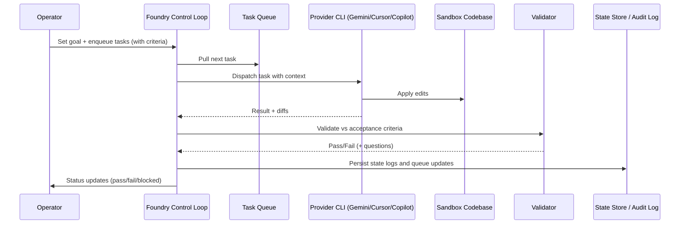

# Foundry

<div align="center">

[](https://github.com/auto-layer/supervisor) 
[](https://opensource.org/licenses/MIT) 
[](https://github.com/ai-supervisor-foundry/foundry/actions)

</div>

### **The persistent control plane for autonomous agentic software development — Kubernetes for AI coding agents**

<br>

> [!WARNING]
> **Public Beta Notice**
> 
> Foundry is currently in **Active Beta**. While the core control loop and state persistence are stable, internal APIs and task schemas may evolve. 
> 
> **Bring Your Own Keys (BYOK)**: Foundry requires your own agentic subscriptions (API keys for Gemini, Copilot, Cursor, etc.). You are responsible for managing your subscription credentials and associated costs.
> 
> **Use with caution** in production environments. We recommend monitoring execution via the `audit.log` or verbose logs.

---

## ⚡ One-Minute Quickstart

Get Foundry running with zero manual configuration. The setup wizard handles infrastructure (Docker), authentication, and launches the dashboard.

```bash
# 1. Clone and Install
git clone https://github.com/auto-layer/supervisor.git
cd supervisor
npm install

# 2. Run the Magic Button
# Handles Infra, Auth, State, and Launches the UI Dashboard
npm run setup
```

**Visit:** [http://localhost:5173](http://localhost:5173) to manage your software factory.

*For manual installation, infrastructure setup, or headless environments, see the [Manual Setup Guide](docs/SETUP_MANUAL.md).*

---

## What This Is (High level)

Foundry is the **Orchestration Layer for AI Software Engineering**.

Just as Kubernetes orchestrates containers, Foundry orchestrates **Agentic Capabilities**. It treats advanced AI tools (Cursor, Copilot, Gemini) not as assistants, but as **managed resources**.

**The Orchestration Lifecycle:**
1.  **Provision:** Foundry spins up a clean, isolated context (Sandbox) for a specific task.
2.  **Dispatch:** It routes the task to the most suitable "Worker Node" (e.g., Gemini for reasoning, Cursor for editing).
3.  **Monitor:** It watches the execution in real-time, enforcing constraints (time, scope, file access).
4.  **Validate & Persist:** It runs deterministic checks (tests, AST) and commits the state only when criteria are met.

This moves AI coding from "Chatting with a Bot" to "Managing a Factory."

Foundry operates as a **persistent control plane**. It runs continuously to:
*   **Persist state:** Save progress after every atomic step to DragonflyDB.
*   **Retain context:** Prevent agent drift by managing the context window explicitly.
*   **Ensure reliability:** Its crash-resilient design allows you to resume exactly where a network/provider halt occurred. No more manual babysitting.

> <small>We will incorporate other providers that are model-only approaches, shortly.</small>

**Built for multi-day agentic coding workflows. Built for determinism. Built for autonomous workflows for lower costs.**

## Why Foundry Exists (The Why)

**The Challenge with Long Agentic Coding Chains:**
- **Context degradation**: After multiple task repetitions and iterations, agent drift occurs → Links between contexts break → Tasks can't reference prior work reliably
- **Manual recovery burden**: If execution halts, resuming requires human intervention and feedback → Wasted setup time
- **Cost spiral**: Without validation, agents make redundant calls → Token costs accumulate
- **No audit trail**: Can't review what happened or why it failed

**The Solution**: Foundry acts as a **deterministic supervisor** for agentic chains. It orchestrates tasks, validates outputs relentlessly, maintains context across repetitions, and keeps costs bounded.

## Why Foundry is Different (USPs)

Most agent frameworks (CrewAI, AutoGen) focus on "conversational teams" or "autonomous planning." Foundry focuses on **infrastructure-grade execution**.

### 1. The "Headless Worker" Abstraction (BYOK, BYO-CLI)

Instead of rebuilding RAG pipelines from scratch, Foundry wraps **standard CLIs & APIs** (Cursor, GitHub Copilot, Gemini, Ollama) and drives them as autonomous worker nodes.

*   **Benefit:** Leverage the $20/month proprietary context engines of your providers for free. Foundry manages the session, you get the intelligence.

### 2. The Anti-Planner (Strict Determinism)
The Execution Engine (Strict Determinism) Foundry is a Task Runner, not a Planner. It decouples intent (the plan) from execution (the agent).
By removing the "planning" responsibility from the worker agent, Foundry eliminates recursive scope creep and ensures the agent focuses solely on executing the explicit goals/behaviours defined by the Operator.

*   **Benefit:** Zero scope creep. The Operator defines a list of tasks; Foundry enforces the execution - much like a backlog queue. It never invents new tasks or hallucinates goals, eventhough it might validate and reason a completed task.

### 3. Local-First "Hybrid" Validation
Foundry uses a cost-optimized validation pipeline that runs **free, local deterministic checks** (AST analysis, Regex, file capacity) *before* ever asking an LLM to verify.
*   **Benefit:** Drastically lower token costs. The LLM is treated as a "Judge of Last Resort," not a first-line debugger.

### 4. Crash-Proof Infrastructure
Modeled after distributed systems, Foundry persists state to DragonflyDB (Redis) after every atomic step.
*   **Benefit:** You can kill the process, upgrade the Supervisor code, restart the server, and `resume` exactly where it left off—even days later.

## How It Works: The Three Pillars (The How)

### 1. You Control the Scope (Operator Authority)
- Define a **goal** (what the project achieves)
- Enqueue **tasks** with acceptance criteria (what each task delivers)
- Provide **boilerplate code** or existing codebase (starting point)

Foundry never invents scope, expands goals, or makes autonomous decisions. You're in control. It's just execution.

### 2. Foundry Executes Reliably (Deterministic Validation)
- Tasks run sequentially in an isolated sandbox
- Each output is validated against acceptance criteria
- State persists after every step (DragonflyDB)
- On failure: Auto-retry with feedback, or block and wait for your input

**Reduces hallucinations via validation. Maintains context across iterations. Predictable behavior via deterministic checks.**

### 3. Cost-Optimized by Design (Hybrid Control Plane)
Agentic APIs are expensive. Foundry uses a **local-first strategy**:
- **Routine validation runs locally** (regex checks, file validation, code structure analysis without API calls) = **no API token cost**
- **Session reuse** for agent tasks = **token reduction across iterations**
- **AI agents only handle true reasoning** = **every API call earns its cost**

Result: Multi-day agentic chains with bounded token consumption compared to naive approaches.

## Overview

Foundry is a **control mechanism** that:
- Holds externally injected goals
- Maintains persistent state
- Executes a fixed control loop
- Delegates tasks to provider/agent CLIs
- Validates results
- Retries on validation failures and ambiguity (up to max retries)
- Halts only on critical failures (execution errors, blocked status)

It does **not**:
- Invent goals
- Act independently
- Replace the operator
- Make autonomous decisions

---

## Usage - CLI Based Usage

While the **[UI Dashboard](/UI/README.md)** is the recommended way to operate Foundry, the CLI remains fully functional for automation and power users.

### Software Factory Workflow

The typical workflow follows this pattern:

1.  **Prepare Code Boilerplates** (optional but recommended)
2.  **Initialize Foundry State**
3.  **Set Goal**
4.  **Enqueue Tasks**
5.  **Start Foundry** (autonomous execution)

### 0. Prepare Code Boilerplates (Optional)

Before starting Foundry, you can prepare initial code in the sandbox directory:

```bash
# Create project directory
mkdir -p sandbox/my-project

# Copy boilerplate/starter code
cp -r my-boilerplate/* sandbox/my-project/
```

**What to include in boilerplates**:
- Project structure (directories, config files)
- Initial dependencies (`package.json`, `requirements.txt`, etc.)
- Starter templates (React components, API routes, etc.)

Foundry will **work with and build upon** this existing code. Tasks can reference existing files, extend functionality, or create new features.

### 1. Initialize Foundry State - CLI Based Usage

Before using Foundry, initialize the state key:

```bash
npm run cli -- init-state --execution-mode AUTO --goal "Build a simple REST API"
```

### 2. Set or Update Goal - CLI Based Usage

Define or update the goal Foundry will work towards:

```bash
npm run cli -- set-goal \
  --description "A simplified, senior-friendly classifieds super app..." \
  --project-id easeclassifieds
```

**Important**: The `--project-id` should match the directory name in `sandbox/` where your boilerplates are located.

### 3. Create Task File(s)

Create task JSON file(s) following the task schema.

**Example: Array of tasks file `tasks.json`**
```json
[
  {
    "task_id": "frontend-001",
    "intent": "Extend existing React component",
    "tool": "gemini",
    "instructions": "Extend the existing App.tsx component to add user authentication.",
    "acceptance_criteria": [
      "App.tsx includes authentication logic",
      "Uses existing React Router setup"
    ],
    "retry_policy": {
      "max_retries": 2
    },
    "status": "pending"
  }
]
```

### 4. Enqueue Tasks - CLI Based Usage

Add tasks to the queue:

```bash
npm run cli -- enqueue \
  --redis-host localhost \
  --redis-port 6499 \
  --state-key supervisor:state \
  --queue-name tasks \
  --queue-db 2 \
  --task-file tasks/tasks.json
```

### 5. Start Foundry Control Loop - CLI Based Usage

Run the Foundry control loop:

```bash
npm run cli -- start \
  --redis-host localhost \
  --redis-port 6499 \
  --state-key supervisor:state \
  --queue-name tasks \
  --queue-db 2
```

### 6. Monitor Execution - CLI Based Usage

**Check Foundry status**:
```bash
npm run cli -- status \
  --redis-host localhost \
  --redis-port 6499 \
  --state-key supervisor:state \
  --queue-name tasks \
  --queue-db 2
```

**Check audit logs**:
```bash
cat sandbox/<project-id>/audit.log.jsonl | tail -20
```

### 7. Halt & Resume - CLI Based Usage

**Halt:**
```bash
npm run cli -- halt \
  --redis-host localhost \
  --redis-port 6499 \
  --state-key supervisor:state \
  --queue-name tasks \
  --queue-db 2 \
  --reason "Operator intervention"
```

**Resume:**
```bash
npm run cli -- resume \
  --redis-host localhost \
  --redis-port 6499 \
  --state-key supervisor:state \
  --queue-name tasks \
  --queue-db 2
```

## How It Works - Detailed

Foundry operates as an agentic **control plane** that executes operator-defined tasks through a fixed control loop.  

It maintains persistent state in DragonflyDB (Redis-compatible), manages a FIFO task queue, dispatches tasks to your chosen Agents/Providers (Gemini, Copilot, Cursor) with injected state context, and validates outputs deterministically.  
(We have [parallelism](/docs/plans/task-dependencies-parallel-execution.md) being worked upon as our roadmap - open to contribution.)

The system enforces sandbox isolation per project, provides append-only audit logging, and supports recovery from crashes or restarts by reloading persisted state.

Foundry never invents goals, expands scope, or makes autonomous decisions—all authority remains with the operator who injects goals and tasks explicitly.

### Execution Stages (Current)
- **Local pre-processing** (Before Agent Call): System tools and scripts execute deterministic checks—regex safety validation, file/byte capacity enforcement, semver compatibility checks, code structure analysis. These run locally without API token cost and may resolve validation gaps, but non-deterministic tasks still require agent review. Flags: `HELPER_DETERMINISTIC_ENABLED`, `HELPER_DETERMINISTIC_PERCENT`.
- **Provider dispatch**: Task sent to Agents/Providers (Gemini, Copilot, Cursor) with state/context injection and session reuse when available. Provider executes task and returns result.
- **Helper agent fallback**: When deterministic checks or provider output leave validation gaps, helper agent generates verification commands to confirm correctness. Helper sessions are reused per project feature to retain context and reduce token consumption.
- **Analytics & metrics**: JSONL metrics (helper durations avg/p95, cache-hit rate, deterministic attempts/success, token usage) persisted alongside audit logs for cost visibility.

### Session Reuse
- Session IDs resolved per feature (`task:prefix` or `project:<id>`) with caps and error thresholds.
- Helper sessions isolated under `helper:validation:<projectId>` and persisted in `state.active_sessions`.
- Toggle via `DISABLE_SESSION_REUSE` if rollback is required.

### High-Level Data Flow


```mermaid
sequenceDiagram
  participant Operator
  participant Foundry as Foundry Control Loop
  participant Queue as Task Queue
  participant Provider as Provider CLI (Gemini/Cursor/Copilot)
  participant Sandbox as Sandbox Codebase
  participant Validator
  participant State as State Store / Audit Log

  Operator->>Foundry: Set goal + enqueue tasks (with criteria)
  Foundry->>Queue: Pull next task
  Foundry->>Provider: Dispatch task with context
  Provider->>Sandbox: Apply edits
  Provider-->>Foundry: Result + diffs
  Foundry->>Validator: Validate vs acceptance criteria
  Validator-->>Foundry: Pass/Fail (+ questions)
  Foundry->>State: Persist state logs and queue updates
  Foundry->>Operator: Status updates (pass/fail/blocked)

```

## Architecture

- **Operator Interface** (`src/infrastructure/tooling/project-cli/cli.ts`): CLI commands for operator control
- **Foundry Core** (`src/application/entrypoint/controlLoop.ts`): Main control loop
- **Tool Dispatcher** (`src/infrastructure/connectors/agents/providers/*`, `src/domain/agents/promptBuilder.ts`): CLI integration
- **Persistence Layer** (`src/application/services/persistence.ts`): DragonflyDB state management
- **Queue Adapter** (`src/domain/executors/taskQueue.ts`): Redis List-based task queue
- **Validator** (`src/application/services/validator.ts`): Deterministic validation
- **AST Service** (`src/application/services/ASTService.ts`): Structural code analysis
- **Validation Cache** (`src/application/services/validationCache.ts`): Redis-based result caching
- **Analytics Service** (`src/application/services/analytics.ts`): Performance tracking
- **Audit Logger** (`src/infrastructure/adapters/logging/auditLogger.ts`): Append-only logging
- **Logger** (`src/infrastructure/adapters/logging/logger.ts`): Centralized verbose logging with stdout flushing for PM2

## Documentation

### Where to start

- **Docs & Wiki (online)** — [Documentation](https://ai-supervisor-foundry.github.io/site/docs/introduction) and [Wiki](https://ai-supervisor-foundry.github.io/site/wiki/overview) at [ai-supervisor-foundry.github.io/site](https://ai-supervisor-foundry.github.io/site/). The static site is built and published from the [site](https://github.com/ai-supervisor-foundry/site) repo; no local copy is kept in this repo.
- **Supervisor context (single source of truth)** — [supervisor-contexts/README.md](supervisor-contexts/README.md) and the [context index](supervisor-contexts/CONTEXT.md) with quick links to overview, architecture, control loop, validation, usage, and configuration.
- **Plans & design** — [docs/plans/](docs/plans/) for architecture proposals, functional test plans, and implementation notes.
- **Tests** — [tests/README.md](tests/README.md) for unit and functional test coverage and how to run them.
- **Investigation & diagnostics** — [scripts/investigations/README.md](scripts/investigations/README.md) for provider health, queue inspection, and log analysis.

### Specs and runbooks (docs/)

All specifications and documentation are in the `docs/` directory:

- [Control Loop](docs/LOOP.md) - Control loop steps
- [State Management](docs/STATE_LIFECYCLE.md) - State lifecycle rules
- [Tool Contracts](docs/TOOL_CONTRACTS.md) - Provider/agent contract
- [Validation](docs/VALIDATION.md) - Validation rules
- [Sandbox](docs/SANDBOX.md) - Sandbox enforcement
- [Recovery](docs/RECOVERY.md) - Recovery scenarios
- [Runbook](docs/RUNBOOK.md) - Operational procedures

See [docs/IMPLEMENTATION_REVIEW.md](docs/IMPLEMENTATION_REVIEW.md) for implementation status.

## State Schema

- [State Schema](STATE_SCHEMA.json) - Foundry state structure
- [Task Schema](TASK_SCHEMA.json) - Task structure

## Common Operations - CLI Based Usage

### Check Foundry Status

**Using the status command** (recommended):
```bash
npm run cli -- status \
  --redis-host localhost \
  --redis-port 6499 \
  --state-key supervisor:state \
  --queue-name tasks \
  --queue-db 2
```

**Check performance metrics**:
```bash
npm run cli -- metrics \
  --redis-host localhost \
  --redis-port 6499 \
  --state-key supervisor:state \
  --queue-name tasks \
  --queue-db 2
```

### View Current Goal

```bash
redis-cli -h localhost -p 6499 GET supervisor:state | jq '.goal'
```

### View Audit Logs

```bash
tail -f sandbox/<project-id>/audit.log.jsonl
```

### Clear State

**Warning**: This deletes all state. Use with caution.

```bash
redis-cli -h localhost -p 6499 DEL supervisor:state
```

## Troubleshooting

### Diagnostics & Investigation Tools

For troubleshooting system issues, use the [Investigation Scripts](./scripts/investigations/README.md) toolkit.

**Quick Diagnostics**:
```bash
# Check provider status and circuit breakers
npx ts-node scripts/investigations/provider-health.ts

# Inspect task queue and blocked tasks
npx ts-node scripts/investigations/task-queue-inspect.ts

# Analyze execution logs and error patterns
npx ts-node scripts/investigations/log-analyzer.ts --summary
```

### Cursor CLI Not Found

```bash
export CURSOR_CLI_PATH=/path/to/cursor
```

### State Key Already Exists

```bash
redis-cli -h localhost -p 6499 DEL supervisor:state
```

### Foundry Retry Behavior

Foundry automatically retries tasks on validation failures or ambiguity:
1.  **Validation Failures**: Retries up to `max_retries` with feedback.
2.  **Ambiguity**: Generates clarification prompt.
3.  **Task Blocking**: After max retries, task is marked blocked; execution continues to next task.

## Programmatic Usage

Foundry can be used programmatically by importing from the main entry point:

```typescript
import {
  controlLoop,
  loadState,
  enqueueTask,
  createQueue,
  type Task,
} from './index';
```

## Key Principles

1.  **Deterministic**: No planning, no task invention
2.  **Operator Authority**: Operator is sole authority for goals, scope, constraints
3.  **Explicit**: All tasks require explicit acceptance criteria
4.  **Validation**: No task runs without validation
5.  **State Persistence**: State persisted after every step
6.  **Retry on Failures**: Validation failures and ambiguity trigger automatic retries
7.  **Optimized**: Skips redundant validation via Redis-based caching
8.  **Measurable**: Detailed performance analytics for every task
9.  **AUTO MODE**: Default and mandatory execution mode

## Local Helper Agent (Optional)

You can configure Foundry to use a local LLM (via Ollama) for helper agent tasks (command generation), reducing latency and cloud costs.

### Prerequisites
- [Ollama](https://ollama.com/) installed and running
- Model pulled (e.g., `ollama pull phi4-mini`)

### Configuration
Add to `.env`:
```bash
USE_LOCAL_HELPER_AGENT=true
LOCAL_HELPER_MODEL=phi4-mini
OLLAMA_BASE_URL=http://localhost:11434
```

## Environmental Impact: Reducing AI Carbon Footprint

AI inference consumes significant computational resources. Foundry's hybrid control plane reduces unnecessary inference calls:

**1. Local Pre-Processing**
- Deterministic checks run locally without cloud API calls: regex validation, file caps, semver checks.
- Reduces unnecessary cloud API calls by routing routine validation locally.

**2. Session Reuse**
- Helper agent sessions cached in DragonflyDB prevent context re-injection across iterations.

**3. Agent as Last Resort**
- Provider CLIs only engaged when deterministic checks cannot resolve the task.

## Important Notes

### Safeguards: Preventing Interrogation Loops and Token Exhaustion

Foundry enforces hard limits:
- **Task Retries**: Max retries per task (default: 3).
- **Interrogation Cycles**: Max 2 interrogation rounds per task.
- **Context Window**: Auto-rotates sessions when provider token limits are reached.
- **Resource Exhaustion**: Automatic exponential backoff.

### Design Constraints

1.  **Operator Authority**: Only operator injects goals and tasks.
2.  **Deterministic Execution**: Fixed control loop.
3.  **State Persistence**: Every step persists.
4.  **Sandbox Isolation**: Projects isolated per directory.
5.  **Audit Trail**: All decisions logged.

## License

This project is licensed under the MIT License - see the [LICENSE](LICENSE) file for details.
