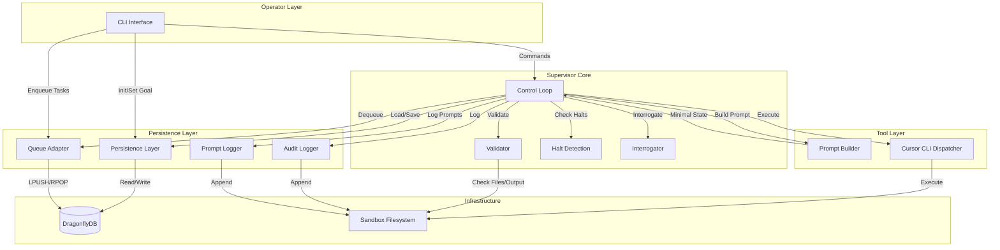
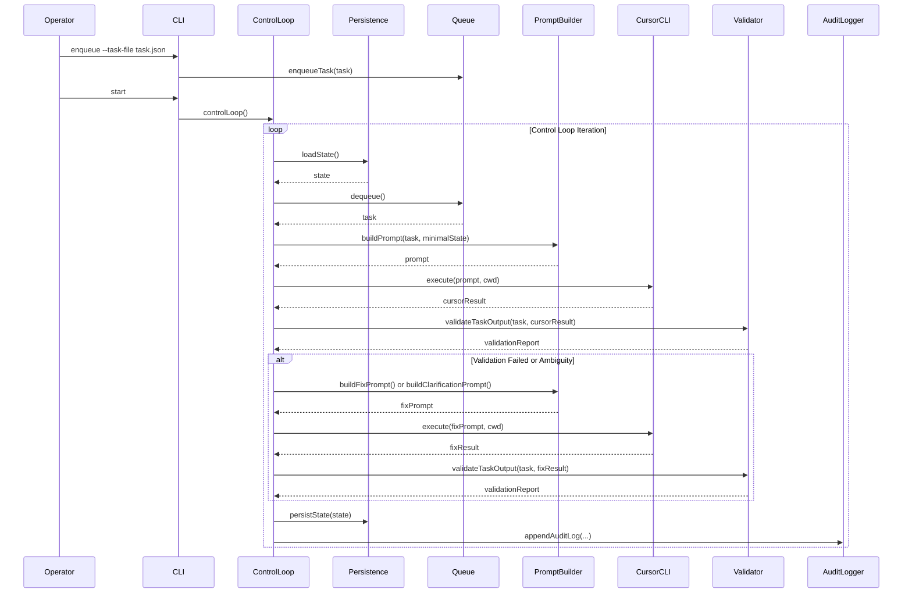
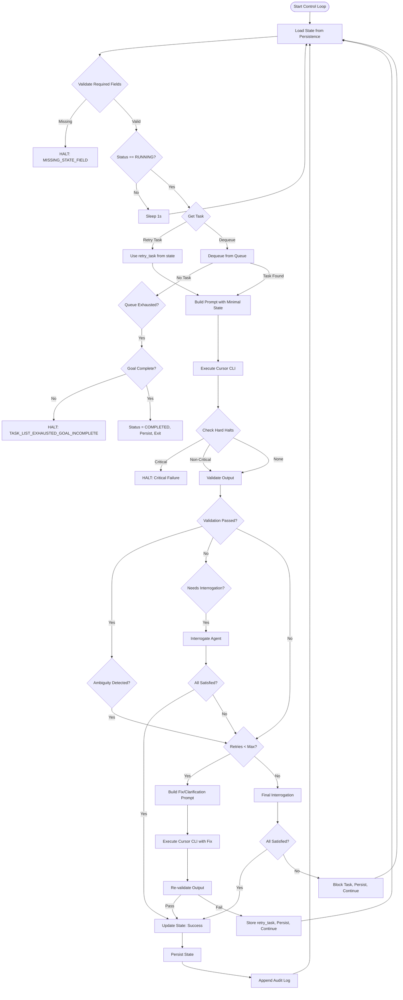

# Supervisor Architecture - Detailed Documentation

## Table of Contents

1. [System Overview](#system-overview)
2. [Architectural Principles](#architectural-principles)
3. [Component Architecture](#component-architecture)
4. [Data Flow](#data-flow)
5. [State Management](#state-management)
6. [Control Loop](#control-loop)
7. [Component Details](#component-details)
8. [Infrastructure](#infrastructure)
9. [Error Handling & Recovery](#error-handling--recovery)
10. [Deployment Architecture](#deployment-architecture)

---

## System Overview

The Supervisor is a **persistent orchestration layer** for AI-assisted software development. It provides a control plane that externalizes memory, intent, and control, enabling long-running, restart-safe project execution with full operator control and auditability.

### Core Purpose

- **Persistence**: State survives crashes, restarts, and interruptions
- **Deterministic Control**: Explicit validation, clear halt conditions
- **Long-Running Projects**: Work on complex projects over days or weeks
- **Full Auditability**: Every action is logged and reviewable
- **Cost-Effective**: Uses free tier tools (Cursor CLI, DragonflyDB)

### High-Level Architecture

```
┌─────────────────────────────────────────────────────────────────┐
│                         OPERATOR                                 │
│  (Injects Goals, Tasks, Controls Execution via CLI)            │
└──────────────────────────┬──────────────────────────────────────┘
                           │
                           ▼
┌─────────────────────────────────────────────────────────────────┐
│                    SUPERVISOR SYSTEM                             │
│                                                                   │
│  ┌──────────────┐  ┌──────────────┐  ┌──────────────┐         │
│  │   CLI Layer  │──▶│ Control Loop │──▶│  Tool Layer  │         │
│  │  (Operator   │  │  (Orchestrates│  │  (Cursor CLI)│         │
│  │   Interface) │  │   Execution) │  │              │         │
│  └──────────────┘  └──────────────┘  └──────────────┘         │
│         │                  │                  │                  │
│         │                  │                  │                  │
│  ┌──────────────┐  ┌──────────────┐  ┌──────────────┐         │
│  │  Persistence │  │    Queue     │  │  Validator    │         │
│  │   (State)    │  │  (Tasks)     │  │  (Output)     │         │
│  └──────────────┘  └──────────────┘  └──────────────┘         │
│         │                  │                  │                  │
│         └──────────────────┴──────────────────┘                  │
│                           │                                      │
│                           ▼                                      │
│              ┌────────────────────────┐                         │
│              │   DragonflyDB (Redis)   │                         │
│              │  - State (DB 0)         │                         │
│              │  - Queue (DB 2)         │                         │
│              └────────────────────────┘                         │
└─────────────────────────────────────────────────────────────────┘
                           │
                           ▼
┌─────────────────────────────────────────────────────────────────┐
│                    SANDBOX ENVIRONMENT                           │
│  ┌──────────────────────────────────────────────────────────┐  │
│  │  Project Directories (per project_id)                     │  │
│  │  - audit.log.jsonl (append-only audit trail)              │  │
│  │  - prompts.log.jsonl (prompt/response logging)             │  │
│  │  - Project source code                                    │  │
│  └──────────────────────────────────────────────────────────┘  │
└─────────────────────────────────────────────────────────────────┘
```

---

## Architectural Principles

### 1. Role Separation

Each module has distinct, non-overlapping responsibilities:

```
┌─────────────────────────────────────────────────────────────┐
│                    ROLE SEPARATION                          │
├─────────────────────────────────────────────────────────────┤
│                                                               │
│  Operator Interface                                          │
│  ├─ Injects initial goal                                     │
│  ├─ Injects tasks                                            │
│  └─ Issues HALT / RESUME                                     │
│                                                               │
│  Supervisor Core                                             │
│  ├─ Owns control loop                                        │
│  ├─ Owns state read/write                                    │
│  └─ Owns validation                                         │
│                                                               │
│  Tool Dispatcher                                             │
│  ├─ Constructs Cursor task prompts                           │
│  └─ Injects state snapshots                                  │
│                                                               │
│  Persistence Layer                                           │
│  └─ DragonflyDB read/write only                             │
│                                                               │
│  Queue Adapter                                               │
│  └─ Redis List integration only                              │
│                                                               │
│  No module may cross responsibilities.                        │
│                                                               │
└─────────────────────────────────────────────────────────────┘
```

### 2. Deterministic Execution

- **No Planning**: Supervisor never invents tasks or goals
- **No Autonomous Decisions**: All authority remains with operator
- **Explicit Validation**: All tasks require explicit acceptance criteria
- **State Persistence**: State persisted after every step
- **Retry on Failures**: Automatic retries with fix/clarification prompts
- **Halt on Critical Failures**: Only execution errors and blocked status halt immediately

### 3. Anti-Goals (What Supervisor Does NOT Do)

- ❌ Autonomous goal refinement
- ❌ Speculative task creation
- ❌ Retry heuristics (uses explicit retry_policy)
- ❌ AI-based validation (deterministic rule-based only)
- ❌ "Helpful" corrections
- ❌ Fallback behaviors

---

## Component Architecture

### Component Diagram



### Component Responsibilities

#### 1. CLI Layer (`src/infrastructure/tooling/project-cli/cli.ts`)

**Purpose**: Operator interface for controlling supervisor

**Commands**:
- `init-state`: Initialize supervisor state
- `set-goal`: Set project goal
- `enqueue`: Add tasks to queue
- `start`: Start control loop
- `halt`: Stop execution
- `resume`: Set status to RUNNING
- `status`: Display current state

**Key Characteristics**:
- Operator is sole authority
- No autonomous recovery
- All commands require explicit parameters

#### 2. Control Loop (`src/application/entrypoint/controlLoop.ts`)

**Purpose**: Main orchestration engine

**Flow**:
```
1. Load State
2. Validate Required Fields
3. Check Status (if not RUNNING, sleep)
4. Retrieve Task (retry_task or dequeue)
5. If no task:
   - Mark queue exhausted
   - If goal incomplete → HALT
   - If goal complete → COMPLETED
6. Determine Working Directory
7. Build Prompt (with minimal state snapshot)
8. Dispatch to CLI Adapter
9. Check Hard Halts (critical failures only)
10. Validate Output
11. Handle Retries/Interrogation:
    - If validation fails → Build fix prompt → Retry
    - If ambiguity → Build clarification prompt → Retry
    - If uncertain → Interrogate agent → Retry
12. On Success:
    - Update state (iteration++, last_task_id, etc.)
    - Persist state
    - Append audit log
```

**Key Characteristics**:
- Single-threaded, sequential execution
- State persisted after every step
- Automatic retry with fix/clarification prompts
- Interrogation phase for uncertain validation

#### 3. Persistence Layer (`src/application/services/persistence.ts`)

**Purpose**: State management in DragonflyDB

**Operations**:
- `loadState()`: Single GET operation, throws if not found
- `persistState()`: Single SET operation, full overwrite

**Key Characteristics**:
- Single key, full overwrite only
- No partial updates
- No Lua scripts
- No pubsub
- No retries (failures surface to caller)

**State Structure**:
```json
{
  "supervisor": {
    "status": "RUNNING" | "HALTED" | "COMPLETED",
    "iteration": 0,
    "last_task_id": "task-001",
    "halt_reason": "...",
    "retry_count_task-001": 1
  },
  "goal": {
    "description": "...",
    "project_id": "...",
    "completed": false
  },
  "queue": {
    "exhausted": false
  },
  "completed_tasks": [...],
  "blocked_tasks": [...],
  "last_validation_report": {...},
  "execution_mode": "AUTO" | "MANUAL",
  "last_updated": "2025-01-01T00:00:00.000Z"
}
```

#### 4. Queue Adapter (`src/domain/executors/taskQueue.ts`)

**Purpose**: Task queue management using Redis Lists

**Operations**:
- `enqueueTask()`: LPUSH task to list
- `dequeueTask()`: RPOP task from list

**Key Characteristics**:
- FIFO queue (first in, first out)
- Uses Redis List (LPUSH/RPOP)
- Separate DB index from state
- No task mutation
- No reordering
- No retries (handled by control loop)

**Queue Structure**:
```
queue:tasks (Redis List)
├─ [Task JSON] (oldest)
├─ [Task JSON]
└─ [Task JSON] (newest)
```

#### 5. Prompt Builder (`src/domain/agents/promptBuilder.ts`)

**Purpose**: Construct prompts for CLI providers with minimal state context

**Functions**:
- `buildPrompt()`: Initial task prompt
- `buildFixPrompt()`: Retry prompt with validation feedback
- `buildClarificationPrompt()`: Retry prompt for ambiguity/questions

**Features**:
- **Smart Context Injection**: Only includes state relevant to the current task (e.g., excludes goal description if task is a simple fix, excludes queue history if not referencing previous work).
- **Task-Type Guidelines**: Detects task type (Implementation, Config, Test, Doc, Refactor) and appends specific best-practice instructions.

**Minimal State Snapshot**:
```typescript
{
  project: {
    id: "project-id",
    sandbox_root: "/path/to/sandbox/project-id"
  },
  goal: { ... }, // Included only if relevant
  queue: { ... } // Included only if relevant
}
```

#### 6. Tool Dispatcher (`src/infrastructure/connectors/agents/providers/cursorCLI.ts`, `copilotCLI.ts`, etc.)

**Purpose**: Execute CLI commands in sandboxed environment via various providers

**Operations**:
- `execute()`: Spawn CLI process with prompt

**Key Characteristics**:
- Enforces cwd strictly (must exist and be directory)
- Captures stdout/stderr verbatim
- No interpretation, no retries, no validation
- 30-minute timeout per task
- Supports agent modes (auto, opus, etc.)

#### 7. Validator (`src/application/services/validator.ts`)

**Purpose**: Deterministic, rule-based validation of task output

**Validation Rules**:
1. **Required Artifacts**: Check if required files exist
2. **Acceptance Criteria**: Check if all criteria are met (file-based checks)
3. **Test Command**: Execute test command if provided
4. **JSON Schema**: Validate JSON output against expected schema
5. **Exit Code**: Check CLI exit code

**Advanced Features**:
- **Confidence Scoring**: Assigns `MatchQuality` (EXACT, HIGH, MEDIUM, LOW) to each criterion. Overall confidence determines need for interrogation.
- **Proactive Helper Agent (V2)**: If validation fails, automatically triggers a Helper Agent with **Code Discovery** (list of actual files) to generate verification commands.

**Key Characteristics**:
- Rule-based only, no LLM calls
- No side effects
- Returns ValidationReport with:
  - `valid`: boolean
  - `confidence`: 'HIGH' | 'MEDIUM' | 'LOW' | 'UNCERTAIN'
  - `failed_criteria`: string[]
  - `uncertain_criteria`: string[]

#### 8. Halt Detection (`src/domain/executors/haltDetection.ts`)

**Purpose**: Detect hard halt conditions in CLI output

**Halt Conditions**:
- `CURSOR_EXEC_FAILURE`: Process failed to execute
- `BLOCKED`: Agent explicitly reported blocked status
- `OUTPUT_FORMAT_INVALID`: Output doesn't match expected format
- `ASKED_QUESTION`: Agent asked a question (non-critical, triggers retry)
- `AMBIGUITY`: Ambiguous language detected (non-critical, triggers retry)

**Key Characteristics**:
- Pattern matching on stdout/stderr
- Critical halts stop immediately
- Non-critical halts trigger retry with clarification

#### 9. Interrogator (`src/domain/executors/interrogator.ts`)

**Purpose**: Ask agent about uncertain/failed validation criteria

**Flow**:
1. **Pre-Analysis**: Scan codebase for keywords related to criteria to find potential file locations.
2. For each uncertain/failed criterion, ask agent directly (injecting pre-analysis findings).
3. Agent responds with yes/no or explanation.
4. Update validation report based on responses.
5. If all criteria satisfied → mark task complete.
6. If criteria still failed → proceed with retry.

**Key Characteristics**:
- Used when validation confidence is UNCERTAIN or LOW
- Max questions per criterion (default: 4)
- Final interrogation before blocking task

#### 10. Audit Logger (`src/infrastructure/adapters/logging/auditLogger.ts`)

**Purpose**: Append-only audit trail of all supervisor actions

**Log Format** (JSONL):
```json
{
  "event": "TASK_START" | "TASK_COMPLETE" | "TASK_BLOCKED" | "HALT" | "COMPLETED",
  "task_id": "task-001",
  "timestamp": "2025-01-01T00:00:00.000Z",
  "state_before": {...},
  "state_after": {...},
  "validation_report": {...},
  "prompt": "...",
  "response": "..."
}
```

**Key Characteristics**:
- Append-only (no modifications)
- One file per project (`sandbox/<project-id>/audit.log.jsonl`)
- Includes full state snapshots (before/after)
- Includes prompts and responses

#### 11. Prompt Logger (`src/infrastructure/adapters/logging/promptLogger.ts`)

**Purpose**: Log all prompts and responses for debugging

**Log Format** (JSONL):
```json
{
  "task_id": "task-001",
  "iteration": 1,
  "type": "PROMPT" | "FIX_PROMPT" | "CLARIFICATION_PROMPT" | "RESPONSE",
  "content": "...",
  "metadata": {
    "agent_mode": "auto",
    "working_directory": "...",
    "prompt_length": 1000
  }
}
```

**Key Characteristics**:
- Separate from audit log
- Includes all prompt types (initial, fix, clarification)
- Includes all responses
- One file per project (`sandbox/<project-id>/prompts.log.jsonl`)

---

## Data Flow

### Task Execution Flow



### State Persistence Flow

```
┌─────────────────────────────────────────────────────────────┐
│                    STATE PERSISTENCE FLOW                    │
├─────────────────────────────────────────────────────────────┤
│                                                               │
│  1. Control Loop Iteration Starts                            │
│     └─▶ Load State (GET supervisor:state)                   │
│                                                               │
│  2. Task Execution                                           │
│     ├─▶ Dequeue Task                                         │
│     ├─▶ Build Prompt                                         │
│     ├─▶ Execute Cursor CLI                                   │
│     ├─▶ Validate Output                                      │
│     └─▶ Handle Retries (if needed)                           │
│                                                               │
│  3. State Update                                             │
│     ├─▶ Update supervisor.iteration++                        │
│     ├─▶ Update supervisor.last_task_id                       │
│     ├─▶ Update supervisor.last_validation_report            │
│     ├─▶ Add to completed_tasks[]                             │
│     └─▶ Update last_updated timestamp                        │
│                                                               │
│  4. Persist State (SET supervisor:state)                    │
│     └─▶ Full overwrite (no partial updates)                  │
│                                                               │
│  5. Append Audit Log                                         │
│     └─▶ Append to sandbox/<project-id>/audit.log.jsonl      │
│                                                               │
└─────────────────────────────────────────────────────────────┘
```

### Retry Flow

```
┌─────────────────────────────────────────────────────────────┐
│                      RETRY FLOW                              │
├─────────────────────────────────────────────────────────────┤
│                                                               │
│  Task Execution                                              │
│    │                                                          │
│    ▼                                                          │
│  Validation Failed OR Ambiguity Detected                    │
│    │                                                          │
│    ▼                                                          │
│  Check Retry Count < max_retries?                           │
│    │                                                          │
│    ├─ YES ──▶ Increment retry_count                          │
│    │          │                                               │
│    │          ▼                                               │
│    │          Build Fix/Clarification Prompt                  │
│    │          │                                               │
│    │          ▼                                               │
│    │          Execute Cursor CLI with Fix Prompt              │
│    │          │                                               │
│    │          ▼                                               │
│    │          Re-validate Output                              │
│    │          │                                               │
│    │          ├─ PASS ──▶ Continue to Success                │
│    │          │                                               │
│    │          └─ FAIL ──▶ Store retry_task in state          │
│    │                       │                                  │
│    │                       └─▶ Retry on Next Iteration      │
│    │                                                          │
│    └─ NO ──▶ Check if Interrogation Needed?                 │
│              │                                                │
│              ├─ YES ──▶ Interrogate Agent                    │
│              │         │                                      │
│              │         ├─ All Satisfied ──▶ Mark Complete    │
│              │         │                                      │
│              │         └─ Still Failed ──▶ Block Task        │
│              │                                                │
│              └─ NO ──▶ Block Task                            │
│                                                               │
└─────────────────────────────────────────────────────────────┘
```

---

## State Management

### State Schema

```typescript
interface SupervisorState {
  supervisor: {
    status: 'RUNNING' | 'HALTED' | 'COMPLETED';
    iteration: number;
    last_task_id?: string;
    halt_reason?: string;
    halt_details?: string;
    retry_count_<task_id>?: number;  // Dynamic keys
    retry_task?: Task;  // Task to retry on next iteration
  };
  goal: {
    description: string;
    project_id?: string;
    completed: boolean;
  };
  queue: {
    exhausted: boolean;
  };
  completed_tasks?: Array<{
    task_id: string;
    completed_at: string;
    validation_report: ValidationReport;
  }>;
  blocked_tasks?: Array<{
    task_id: string;
    blocked_at: string;
    reason: string;
  }>;
  last_validation_report?: ValidationReport;
  execution_mode: 'AUTO' | 'MANUAL';
  last_updated: string;
}
```

### State Lifecycle

```
┌─────────────┐
│  INITIALIZE │  (init-state command)
│  status:    │
│  HALTED     │
└──────┬──────┘
       │
       ▼
┌─────────────┐
│  SET GOAL   │  (set-goal command)
│  status:    │
│  HALTED     │
└──────┬──────┘
       │
       ▼
┌─────────────┐
│  ENQUEUE    │  (enqueue command)
│  status:    │
│  HALTED     │
└──────┬──────┘
       │
       ▼
┌─────────────┐
│   RESUME    │  (resume command)
│  status:    │
│  RUNNING    │
└──────┬──────┘
       │
       ▼
┌─────────────┐
│    START    │  (start command)
│  status:    │
│  RUNNING    │
│             │
│  Loop:      │
│  - Load     │
│  - Dequeue  │
│  - Execute  │
│  - Validate │
│  - Persist  │
└──────┬──────┘
       │
       ├─▶ Queue Exhausted + Goal Complete
       │   └─▶ COMPLETED
       │
       ├─▶ Queue Exhausted + Goal Incomplete
       │   └─▶ HALTED (TASK_LIST_EXHAUSTED_GOAL_INCOMPLETE)
       │
       ├─▶ Critical Failure
       │   └─▶ HALTED (CURSOR_EXEC_FAILURE, BLOCKED, etc.)
       │
       └─▶ Operator Halt
           └─▶ HALTED (operator intervention)
```

### State Persistence Strategy

**Single Key, Full Overwrite**:
- State stored as single JSON object in DragonflyDB
- Key: `supervisor:state` (operator-defined)
- DB Index: `0` (default, configurable)
- Every write is full overwrite (SET command)
- No partial updates, no Lua scripts

**Persistence Points**:
1. After every task completion
2. After task blocking
3. After state initialization
4. After goal update
5. After halt
6. After completion

**Recovery**:
- State is reloaded on every iteration
- If state key doesn't exist → throw error (operator must init)
- If JSON parse fails → throw error (corrupted state)

---

## Control Loop

### Control Loop Algorithm



### Control Loop Steps (Detailed)

#### Step 1: Load State
- Single GET operation from DragonflyDB
- Deep copy for state diff tracking
- Validate required fields exist
- Performance: Logged with `[PERFORMANCE]` prefix

#### Step 2: Check Status
- If status !== "RUNNING": sleep 1s and continue
- If status === "RUNNING": proceed to task retrieval

#### Step 3: Retrieve Task
- Priority: Check `retry_task` in state first
- If no retry_task: Dequeue from queue
- If no task: Mark queue exhausted and check goal completion

#### Step 4: Build Prompt
- Create minimal state snapshot (Smart Context Injection: includes only relevant goal, queue, or completed tasks based on intent)
- Detect task type (Implementation, Config, Test, etc.) and inject specific guidelines
- Build prompt with task instructions and acceptance criteria
- Log prompt to `prompts.log.jsonl`

#### Step 5: Execute Cursor CLI
- Spawn cursor CLI process in sandbox directory
- Capture stdout/stderr verbatim
- 30-minute timeout per task
- Log response to `prompts.log.jsonl`

#### Step 6: Check Hard Halts
- Pattern matching on output for critical failures
- Critical halts: `CURSOR_EXEC_FAILURE`, `BLOCKED`, `OUTPUT_FORMAT_INVALID`
- Non-critical halts: `ASKED_QUESTION`, `AMBIGUITY` (trigger retry)

#### Step 7: Validate Output
- Rule-based validation (no LLM calls)
- Check required artifacts, acceptance criteria, test commands
- Calculate MatchQuality (EXACT/HIGH/MEDIUM/LOW) and Confidence Score
- Proactive Helper Agent (V2): If validation fails, automatically trigger Helper Agent to verify with code discovery
- Return ValidationReport with confidence level

#### Step 8: Handle Retries/Interrogation
- If validation fails or ambiguity detected:
  - Check retry count < max_retries
  - If needs interrogation (UNCERTAIN/LOW confidence): 
    - Perform Pre-Analysis (search codebase for keywords)
    - Interrogate agent with targeted questions
  - Build fix/clarification prompt
  - **Smart Retry**: If agent fails with the exact same error twice, switch to "Strict Mode" fix prompt
  - Execute Cursor CLI with fix prompt
  - Re-validate output
  - If still fails: Store retry_task for next iteration
  - If max retries exceeded: Final interrogation → Block or Complete

#### Step 9: Update State (On Success)
- Increment `supervisor.iteration`
- Set `supervisor.last_task_id`
- Set `supervisor.last_validation_report`
- Add to `completed_tasks[]`
- Update `last_updated` timestamp

#### Step 10: Persist State
- Full overwrite (SET command)
- Performance: Logged with `[PERFORMANCE]` prefix

#### Step 11: Append Audit Log
- Append to `sandbox/<project-id>/audit.log.jsonl`
- Includes state_before, state_after, validation_report, prompt, response

---

## Component Details

### CLI Commands

#### `init-state`
```bash
npm run cli -- init-state \
  --redis-host localhost \
  --redis-port 6499 \
  --state-key supervisor:state \
  --queue-name tasks \
  --queue-db 2 \
  --execution-mode AUTO
```

**Creates**:
- Initial state with status `HALTED`
- Empty goal description
- Empty queue
- Execution mode

#### `set-goal`
```bash
npm run cli -- set-goal \
  --description "Build microservice" \
  --project-id my-service
```

**Updates**:
- `goal.description`
- `goal.project_id` (optional)

#### `enqueue`
```bash
npm run cli -- enqueue \
  --task-file tasks/task-001.json
```

**Supports**:
- Single task file (one task object)
- Array of tasks file (multiple tasks, all enqueued)

#### `start`
```bash
npm run cli -- start
```

**Starts**:
- Control loop execution
- Continues until queue exhausted or halted

#### `halt`
```bash
npm run cli -- halt \
  --reason "Operator intervention"
```

**Sets**:
- `supervisor.status = HALTED`
- `supervisor.halt_reason`
- Persists state and exits

#### `resume`
```bash
npm run cli -- resume
```

**Sets**:
- `supervisor.status = RUNNING`
- Does NOT start control loop (use `start` command)

#### `status`
```bash
npm run cli -- status
```

**Displays**:
- Supervisor status and iteration
- Goal information
- Queue status
- Task statistics
- Last validation report
- Execution mode

### Task Schema

```typescript
interface Task {
  task_id: string;                    // Unique identifier
  intent: string;                      // Brief description
  tool: 'cursor';                  // Must be 'cursor'
  instructions: string;                 // Detailed instructions for Cursor CLI
  acceptance_criteria: string[];       // ALL must be met
  retry_policy: {
    max_retries: number;                // Default: 3
  };
  status: 'pending' | 'in_progress' | 'completed' | 'blocked';
  working_directory?: string;           // Overrides project_id default
  required_artifacts?: string[];        // File paths (relative to sandbox project)
  test_command?: string;                // Command to run for validation
  tests_required?: boolean;             // Whether tests must pass
  expected_json_schema?: Record<string, string>;  // JSON schema for output
  agent_mode?: 'auto' | 'opus' | string;  // Cursor CLI agent mode
}
```

### Validation Rules

1. **Required Artifacts Rule**
   - Check if all files in `required_artifacts` exist
   - Paths relative to sandbox project directory

2. **Acceptance Criteria Rule**
   - For each criterion, check if condition is met
   - File existence, content matching, etc.
   - ALL criteria must pass

3. **Test Command Rule**
   - If `test_command` provided, execute it
   - If `tests_required === true`, exit code must be 0

4. **JSON Schema Rule**
   - If `expected_json_schema` provided, validate output
   - Check types, required fields, no extra fields

5. **Exit Code Rule**
   - Cursor CLI exit code should be 0 (non-critical)

---

## Infrastructure

### DragonflyDB Setup

**Docker Compose** (`docker-compose.yml`):
```yaml
services:
  dragonflydb:
    image: docker.dragonflydb.io/dragonflydb/dragonfly:latest
    ports:
      - "6499:6379"
    volumes:
      - dragonfly-data:/data
    command: --maxmemory 2gb --loglevel verbose
```

**Database Separation**:
- **State DB**: Index `0` (default)
  - Key: `supervisor:state`
  - Contains: Full supervisor state JSON

- **Queue DB**: Index `2` (configurable)
  - Key: `queue:tasks`
  - Contains: Redis List of task JSON objects

### Sandbox Structure

```
supervisor/
└── sandbox/                    # Sandbox root (configurable)
    └── <project-id>/           # Project-specific directory
        ├── audit.log.jsonl     # Append-only audit trail
        ├── prompts.log.jsonl   # Prompt/response logging
        └── [project files]     # Project source code
```

**Sandbox Enforcement**:
- All Cursor CLI execution happens in sandbox directory
- Working directory determined by:
  1. `task.working_directory` (if provided)
  2. `sandbox/<project-id>` (default)

### Logging

**Application Logs** (PM2):
- `logs/supervisor-out.log`: stdout
- `logs/supervisor-error.log`: stderr
- Log levels: `[VERBOSE]`, `[PERFORMANCE]`, `[STATE_TRANSITION]`

**Audit Logs** (JSONL):
- `sandbox/<project-id>/audit.log.jsonl`
- Append-only, includes full state snapshots

**Prompt Logs** (JSONL):
- `sandbox/<project-id>/prompts.log.jsonl`
- All prompts and responses

---

## Error Handling & Recovery

### Error Categories

1. **State Errors**
   - Missing state key → Operator must init
   - JSON parse failure → Corrupted state, operator must fix
   - Missing required fields → HALT: MISSING_STATE_FIELD

2. **Execution Errors**
   - Cursor CLI execution failure → HALT: CURSOR_EXEC_FAILURE
   - Invalid working directory → HALT: CURSOR_EXEC_FAILURE
   - Timeout (30 minutes) → HALT: CURSOR_EXEC_FAILURE

3. **Validation Errors**
   - Validation failed → Retry with fix prompt
   - Max retries exceeded → Block task (after final interrogation)

4. **Queue Errors**
   - Queue exhausted + goal incomplete → HALT: TASK_LIST_EXHAUSTED_GOAL_INCOMPLETE
   - Queue exhausted + goal complete → COMPLETED

5. **Halt Conditions**
   - Critical: `CURSOR_EXEC_FAILURE`, `BLOCKED`, `OUTPUT_FORMAT_INVALID`
   - Non-critical: `ASKED_QUESTION`, `AMBIGUITY` (trigger retry)

### Recovery Scenarios

#### Scenario 1: Process Crash
1. Supervisor process crashes
2. State persisted in DragonflyDB (last successful persist)
3. Operator restarts supervisor
4. Control loop loads state and continues from last task

#### Scenario 2: DragonflyDB Restart
1. DragonflyDB container restarts
2. If using volume: State persists, supervisor continues
3. If no volume: State lost, operator must re-init

#### Scenario 3: Task Blocked
1. Task fails validation after max retries
2. Task added to `blocked_tasks[]`
3. Supervisor continues to next task
4. Operator can review blocked tasks and intervene

#### Scenario 4: Operator Halt
1. Operator issues `halt` command
2. State persisted with status `HALTED`
3. Operator resolves issues
4. Operator issues `resume` then `start`

---

## Deployment Architecture

### Local Development

```
┌─────────────────────────────────────────────────────────────┐
│                    LOCAL DEVELOPMENT                         │
├─────────────────────────────────────────────────────────────┤
│                                                               │
│  ┌──────────────┐    ┌──────────────┐    ┌──────────────┐  │
│  │   Terminal   │───▶│   Node.js    │───▶│ DragonflyDB  │  │
│  │   (CLI)      │    │  (Supervisor)│    │  (Docker)    │  │
│  └──────────────┘    └──────────────┘    └──────────────┘  │
│         │                    │                    │          │
│         │                    │                    │          │
│         └────────────────────┴────────────────────┘         │
│                              │                                │
│                              ▼                                │
│                    ┌──────────────────┐                      │
│                    │  Sandbox FS      │                      │
│                    │  (Local Disk)    │                      │
│                    └──────────────────┘                      │
│                                                               │
└─────────────────────────────────────────────────────────────┘
```

### Production Deployment (PM2)

```
┌─────────────────────────────────────────────────────────────┐
│                    PRODUCTION DEPLOYMENT                      │
├─────────────────────────────────────────────────────────────┤
│                                                               │
│  ┌──────────────┐    ┌──────────────┐    ┌──────────────┐  │
│  │   PM2        │───▶│   Node.js     │───▶│ DragonflyDB  │  │
│  │  (Process    │    │  (Supervisor) │    │  (Docker/    │  │
│  │   Manager)  │    │                │    │   Container) │  │
│  └──────────────┘    └──────────────┘    └──────────────┘  │
│         │                    │                    │          │
│         │                    │                    │          │
│         └────────────────────┴────────────────────┘         │
│                              │                                │
│                              ▼                                │
│                    ┌──────────────────┐                      │
│                    │  Sandbox FS      │                      │
│                    │  (Persistent     │                      │
│                    │   Volume)        │                      │
│                    └──────────────────┘                      │
│                                                               │
│  Logs:                                                         │
│  - PM2: logs/supervisor-*.log                                │
│  - Audit: sandbox/<project-id>/audit.log.jsonl               │
│  - Prompts: sandbox/<project-id>/prompts.log.jsonl           │
│                                                               │
└─────────────────────────────────────────────────────────────┘
```

### PM2 Configuration

**ecosystem.config.js**:
```javascript
module.exports = {
  apps: [{
    name: 'supervisor',
    script: 'dist/cli.js',
    args: 'start --redis-host localhost --redis-port 6499 --state-key supervisor:state --queue-name tasks --queue-db 2',
    instances: 1,
    exec_mode: 'fork',
    error_file: 'logs/supervisor-error.log',
    out_file: 'logs/supervisor-out.log',
    log_date_format: 'YYYY-MM-DD HH:mm:ss Z',
    merge_logs: true,
    autorestart: true,
    max_restarts: 10,
    min_uptime: '10s'
  }]
};
```

---

## Summary

The Supervisor architecture is designed around **strict separation of concerns**, **deterministic execution**, and **operator authority**. Key architectural decisions:

1. **Single-threaded control loop** ensures sequential, predictable execution
2. **Full state overwrite** simplifies persistence and recovery
3. **Minimal state injection** reduces prompt size and cost
4. **Rule-based validation** ensures deterministic results
5. **Automatic retry with fix/clarification** handles common failure modes
6. **Interrogation phase** resolves uncertain validation
7. **Append-only audit logs** provide full traceability
8. **Sandbox isolation** prevents cross-project contamination

The system is **restart-safe**, **crash-resistant**, and **fully auditable**, making it suitable for long-running AI-assisted development projects.

